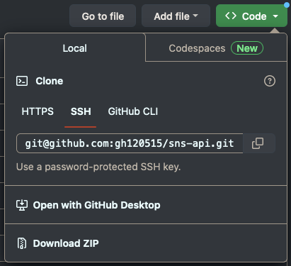
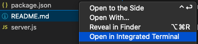
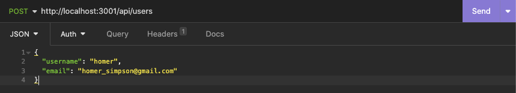

# Social Network API

## Description

<!-- This JavaScript based application will allow the user to manage the back-end of an e-commerce website, using Sequelize to manage a MySQL-based database.

This app was built to test the builder's knowledge on Object Relational Mapping (ORM), through integrating a MySQL database to a back-end app using Sequelize. -->

## Installation

It is assumed that the user of this app has some basic knowledge in code editing (the app itself can be used through the below steps).

The following are required to use this app:

1. Download the repository 

You can do this through the 'Code' button above this README; for example, you can clone the repository to your local machine.

<!--  -->

2. Node.js

You can skip this step if you already have Node.js in your local machine - you can check your current version in your terminal through the below command:

    node -v

Otherwise, [this link](https://nodejs.dev/en/learn/how-to-install-nodejs/) will highlight some common options to install Node.js - do note that the process may vary between MacOS, Windows and Linux.

Functionality has been confirmed on Node.js version 16.20.0 & version 18.16.0. Note that other versions may not function as intended.

3. MongoDB

MongoDB will be required to manage the database. 

<!-- Refer to the [installation guide](https://coding-boot-camp.github.io/full-stack/mysql/mysql-installation-guide) for full details. -->

## Usage

After performing the basic setup, open the repository that you downloaded / cloned - you can do this in multiple ways, such as through the terminal.

The most convinient method is through VS Code (source-code editor program), which has a function where you can directly open the terminal in the directory (e.g.) right-click on the 'Develop' folder, then select 'Open in Integrated Terminal'.

<!--  -->

After opening the repository directory, do the following:

1. Open the terminal in the 'db' folder

Then set up the database after logging into MySQL (your own cretidentials may be required):

<!-- 

    SOURCE schema.sql -->

2. Open the terminal in the 'Develop' folder

Then, enter the following to run the app:

    <!-- npm i (install) only required for the initial run (will install required dependencies) -->
    npm i && npm start

    <!-- seeding the database (setting up sample data for the database) -->
    npm run seed

    <!-- on subsequent runs: -->
    npm start

3. Access the database through API GET / POST / PUT / DELETE routes

This can be done in various ways - example include through the API Client [Insomnia](https://insomnia.rest/), with a sample screenshot of the POST route below.

<!--  -->

### Demonstration

[Walkthrough Video]()

## Credits

Guidelines by University of Adelaide.

## License

